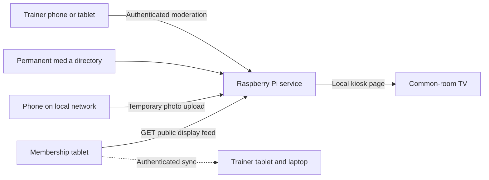

# Common-room display - technical design

**Feature:** Raspberry Pi common-room display
**Status:** Draft
**Created:** 2026-08-31
**Last updated:** 2026-10-05 19:28:48 UTC+2 by sbalslev

## Architecture



The Raspberry Pi is a public display appliance. It does not use `DeviceType`, pair
with another device, receive trust propagation, or call `/api/sync/pull`. This
keeps the existing trusted synchronization boundary intact.

## Components

### Membership tablet display feed

Add a route such as `GET /api/display/v1/feed` to the existing Ktor server. A
dedicated `DisplayFeedService` reads local Room data and returns only display DTOs.
The route is read-only and does not reuse `SyncPayload` or entity serializers.

Recommended response shape:

```json
{
  "schemaVersion": 1,
  "generatedAt": "2026-08-31T18:30:00Z",
  "clubDate": "2026-08-31",
  "slides": [
    {
      "type": "dailyScore",
      "title": "Dagens resultater",
      "entries": [
        {
          "displayName": "Søren B.",
          "discipline": "PISTOL",
          "points": 184
        }
      ]
    }
  ]
}
```

The feed now also supports an optional `activity` object. When present, score
entries may include `classification` and `affiliation`. These fields are additive,
so existing schema-version 1 consumers can ignore them. The feed builder selects
member sessions associated with the active activity and merges visible guest
results. It uses internal IDs only while grouping and never serializes those IDs.

Use a sealed DTO model so each slide has a defined contract. Avoid maps containing
arbitrary database values. The endpoint builds names with the existing abbreviated
name behavior in `CelebrationViewModel`, moved to a shared helper only if both paths
need it.

The birthday calculation uses the inclusive window from `today - 7 days` through
`today`. It compares month and day against each date in the window so that the rule
works across year boundaries. Leap-day behavior must be covered by tests.

### Raspberry Pi service

Create a top-level `display/` component when implementation begins. A small Python
service is preferred because it runs comfortably on a Raspberry Pi 2 and provides
mature image-processing and HTTP libraries.

Suggested runtime:

- Raspberry Pi OS Lite, 32-bit.
- Python 3 with a small ASGI or WSGI framework.
- Pillow for image decoding, orientation correction, resizing, re-encoding, and
  metadata removal.
- SQLite for media metadata and settings.
- Chromium in kiosk mode for the local display page.
- `systemd` units for the service and browser session.

The exact Python framework and supported versions must be selected against the
versions available on the target Raspberry Pi OS image during Task 1.

### Kiosk web interface

The display page runs locally and requests a combined playlist from the Pi service.
The Pi merges cached tablet slides with active photos. The browser never needs to
contact the membership tablet directly.

Keep the interface light:

- Static HTML, CSS, and small JavaScript modules.
- Pre-sized images, with no client-side image processing.
- One active and one preloaded slide.
- Simple opacity transitions.
- No large client framework in the first release.

The statistics panel renders every discipline returned by the tablet. Discipline
leaderboards wrap into a two-column grid so additional disciplines remain visible
without replacing the daily-results overview.

### Upload interface

The preferred QR points to a rotating HTTPS capability URL on
`iss-skydning.dk`. The 256-bit random token is placed in the URL fragment, so it is
not sent in the initial request or included in normal server logs. Browser
JavaScript removes the fragment and sends the token in an upload header.

The website stores the upload in a bounded, four-hour queue. The Pi creates a new
invitation every 55 minutes and polls the queue over outbound HTTPS using a
separate display credential. It validates and re-encodes each image through the
existing local image pipeline before acknowledging delivery. Invalid images are
rejected explicitly so one poison item cannot block the queue.

The Pi's Avahi `.local` upload URL remains an offline fallback. No inbound internet
port is opened to the Pi.

Initial limits:

- 10 MB request size.
- 20 megapixels after decoding.
- Five accepted uploads per client address per hour.
- 20 accepted uploads per rotating invitation.
- One-hour invitation lifetime with rotation after 55 minutes.
- Four-hour lifetime.
- Configurable total temporary-media quota.

Animated images are flattened to one frame in the first release. SVG and other
active document formats are rejected.

### Moderation interface

The trainer page is responsive and served by the Pi. Store only a salted password
or PIN hash. Use an expiring secure session cookie. Same-origin form protection is
required for state-changing requests.

Moderation actions are:

- Approve or reject pending media.
- Delete active media.
- Pause or resume media.
- Extend expiry.
- Promote temporary media to permanent.
- Change upload mode and display timing.

Deletion first removes the item from the active playlist, then removes the file.
This makes a trainer deletion visible immediately even if file cleanup must retry.

## Storage model

```text
display/
  data/
    display.db
    cache/display-feed.json
    media/temporary/
    media/permanent/
    media/thumbnails/
```

Suggested media record fields:

| Field | Purpose |
|-------|---------|
| `id` | Random public-safe identifier |
| `kind` | `temporary` or `permanent` |
| `status` | `pending`, `active`, `paused`, `expired`, or `deleted` |
| `created_at` | Upload or import time |
| `expires_at` | Required for temporary media |
| `content_hash` | Duplicate detection |
| `image_path` | Processed display image |
| `thumbnail_path` | Moderation thumbnail |
| `width`, `height` | Processed dimensions |
| `source` | `public_upload`, `trainer`, or `sd_import` |

Use database transactions and atomic renames so interrupted writes do not create
playlist entries that point to incomplete files.

## Feed availability and discovery

By default, discover the membership tablet through its existing
`_medlemssync._tcp.local.` advertisement and select only advertisements whose
`deviceType` is `MEMBER_TABLET`. Discovery does not pair the Pi or grant sync
access. The Pi requests only `/api/display/v1/feed`, validates its allowlisted
schema, and keeps an explicit URL configuration as a fallback for networks that
block multicast DNS.

The Pi keeps the last valid feed on disk. Failed requests use exponential backoff
with a capped interval while local photos continue rotating. A stale indicator is
shown without replacing the content with an error screen.

## Security boundaries

| Surface | Access | Data or operations |
|---------|--------|--------------------|
| Tablet display feed | Local network, no token | Redacted display DTOs only |
| Tablet sync API | Paired devices | Existing synchronized entities |
| Pi upload page | Local network, no account | Create bounded temporary media |
| Pi display page | Local Pi and local network | Read active playlist |
| Pi trainer page | Authenticated trainer | Moderate media and settings |

The display route should have its own request logging and rate limiter. Do not add
an authentication bypass to the sync route. Contract tests should serialize a feed
and assert that prohibited field names and representative sensitive values are
absent.

## Failure behavior

| Failure | Expected behavior |
|---------|-------------------|
| Membership tablet offline | Use cached feed and mark it stale |
| Pi loses network | Continue local slideshow; watchdog reconnects Wi-Fi |
| Browser crashes | `systemd` restarts kiosk |
| Service crashes | `systemd` restarts service; browser retries |
| Service accepts no playlist requests | Watchdog restarts the backend and kiosk within one minute |
| Disk approaches quota | Reject uploads; keep display running |
| Invalid image | Reject without adding a media record |
| Power loss during upload | Remove orphan temporary files at startup |

The watchdog probes `/api/playlist`, not only the shallow health endpoint, so it
also detects failures in media expiry or playlist assembly. Backend recovery
restarts the dependent Chromium kiosk and reapplies its anti-blanking settings.
Persistent journaling retains service and network evidence across a reboot.

## Testing strategy

- Android unit tests for aggregation, birthday windows, name abbreviation, and DTO
  serialization.
- Android route tests for status codes, method restrictions, and absence of private
  fields.
- Pi unit tests for expiry, quota, rate limits, and moderation authorization.
- Image corpus tests for malformed, oversized, incorrectly labelled, and metadata-
  bearing files.
- Browser tests at 1280x720 and 1920x1080 for slide sizing and upload flow.
- Hardware soak test on a Raspberry Pi 2 for at least 48 hours.
- Power-loss and tablet-offline recovery tests.

## Decisions

1. Keep the Pi outside the trusted sync mesh.
2. Publish a narrow feed instead of weakening sync authentication.
3. Store common-room photos only on the Pi in the first release.
4. Expire public uploads after four hours by default.
5. Show birthdays from today and the previous seven days.
6. Abbreviate names by default and never expose birth dates or ages.
